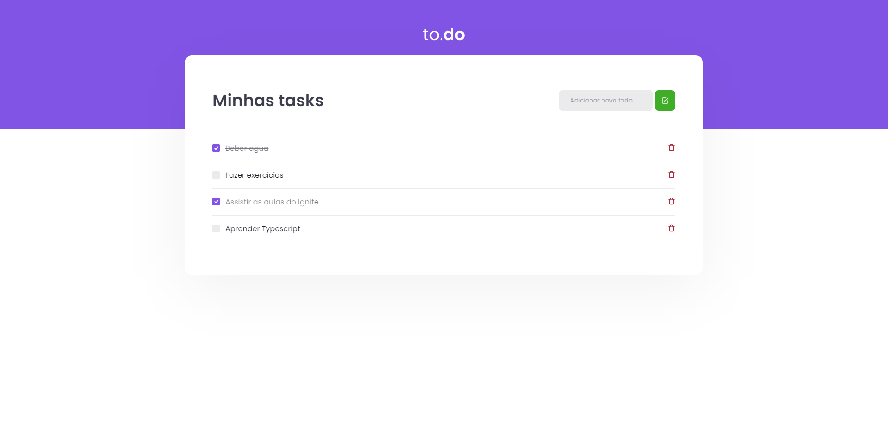

  

## Sobre
Aplicação realizada como desafio do **Chapter I do Ignite da Rocketseat**, uma construção de uma lista de afazeres com opções de marcar como feitos e excluir os afazeres.

## Desafios
  - [x] Criar uma função para adicionar novas tasks.
    - [x] Não adicionar tasks sem titulo.
  - [x] Criar uma função para marcar as tasks completadas.
  - [x] Criar uma função para excluir uma task já completada.

## Imagem

  

## Autor

## [Gabriel Bittencourt Penteado](https://www.linkedin.com/in/gabriel-bittencourt-penteado/)

#### Feito com 🤎 por *Gabriel Bittencourt Penteado*. Entre em contato! 👋🏽